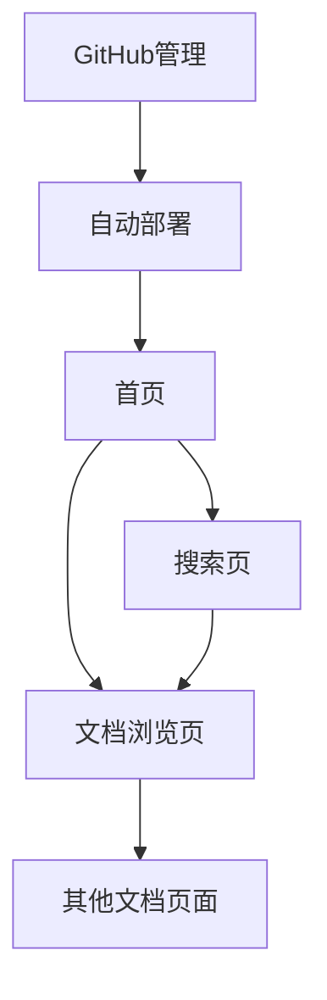

# docWiki 产品需求文档

## 1. Product Overview

docWiki是一个基于Docsify + Cloudflare Pages的纯静态知识库系统，采用"零构建"方案实现Markdown文档的在线管理和展示。
- 解决企业或团队知识分散、难以统一管理的问题，为内容创作者和知识工作者提供简单易用的文档平台。
- 目标是打造维护成本最低、部署最简单的现代化wiki系统，支持快速迁移和长期维护。

## 2. Core Features

### 2.1 User Roles

| Role | Registration Method | Core Permissions |
|------|---------------------|------------------|
| Anonymous User | 无需注册 | 可浏览公开文档内容 |
| Authenticated User | 通过Cloudflare Zero Trust认证 | 可访问受保护内容，查看完整文档 |
| Content Editor | GitHub仓库协作者权限 | 可编辑和提交文档内容 |
| Administrator | GitHub仓库管理员权限 | 可管理仓库设置、部署配置和访问控制 |

### 2.2 Feature Module

我们的wiki系统包含以下主要页面：
1. **首页**: 欢迎页面、导航菜单、文档概览
2. **文档浏览页**: 文档内容展示、侧边栏导航、面包屑导航
Note **UI**: in Engligh only； Support Mermaid

### 2.3 Page Details

| Page Name | Module Name | Feature description |
|-----------|-------------|---------------------|
| 首页 | 欢迎区域 | Display wiki title, description and main navigation links |
| 首页 | 导航菜单 | Show main document categories and quick access links |
| 首页 | 文档概览 | Display recent updates and popular documents |
| 文档浏览页 | 内容展示 | Render Markdown content with syntax highlighting and formatting |
| 文档浏览页 | 侧边栏导航 | Show document tree structure with collapsible sections |
| 文档浏览页 | 面包屑导航 | Display current document path and enable quick navigation |
| 文档浏览页 | 代码高亮 | Highlight code blocks with Prism.js for multiple languages |
| 搜索页 | 搜索输入 | Provide search input with auto-complete and suggestions |
| 搜索页 | 结果展示 | Display search results with snippets and relevance ranking |
| 搜索页 | 过滤选项 | Filter results by document type, date, and categories |
| 管理后台 | 文档管理 | Manage documents through GitHub web interface |
| 管理后台 | 访问控制 | Configure authentication and authorization via Cloudflare Zero Trust |

## 3. Core Process

**普通用户流程：**
用户访问wiki首页 → 浏览文档分类 → 点击进入具体文档 → 阅读内容 → 使用搜索功能查找相关信息 → 通过侧边栏导航浏览其他文档

**内容编辑者流程：**
编辑者登录GitHub → 进入wiki仓库 → 在docs目录下创建或编辑Markdown文件 → 提交更改 → Cloudflare Pages自动部署更新 → 用户可见最新内容

## 4. User Interface Design

### 4.1 Design Style

- **主色调**: #42b883 (Vue绿色主题), 辅助色 #2c3e50 (深蓝灰)
- **按钮样式**: 圆角按钮设计，hover效果平滑过渡
- **字体**: 系统默认字体栈，英文使用Helvetica/Arial
- **布局风格**: 左侧固定导航栏 + 右侧内容区域的经典文档布局
- **图标风格**: 简洁线性图标，支持搜索、导航

### 4.2 Page Design Overview

| Page Name | Module Name | UI Elements |
|-----------|-------------|-------------|
| 首页 | 欢迎区域 | Large title with gradient background, subtitle text, call-to-action buttons with rounded corners |
| 首页 | 导航菜单 | Horizontal navigation bar with hover effects, dropdown menus for categories |
| 文档浏览页 | 内容展示 | Clean typography with proper line spacing , code blocks with syntax highlighting is not requied. |
| 文档浏览页 | 侧边栏导航 | Collapsible tree structure with indentation, active state highlighting, smooth animations |
