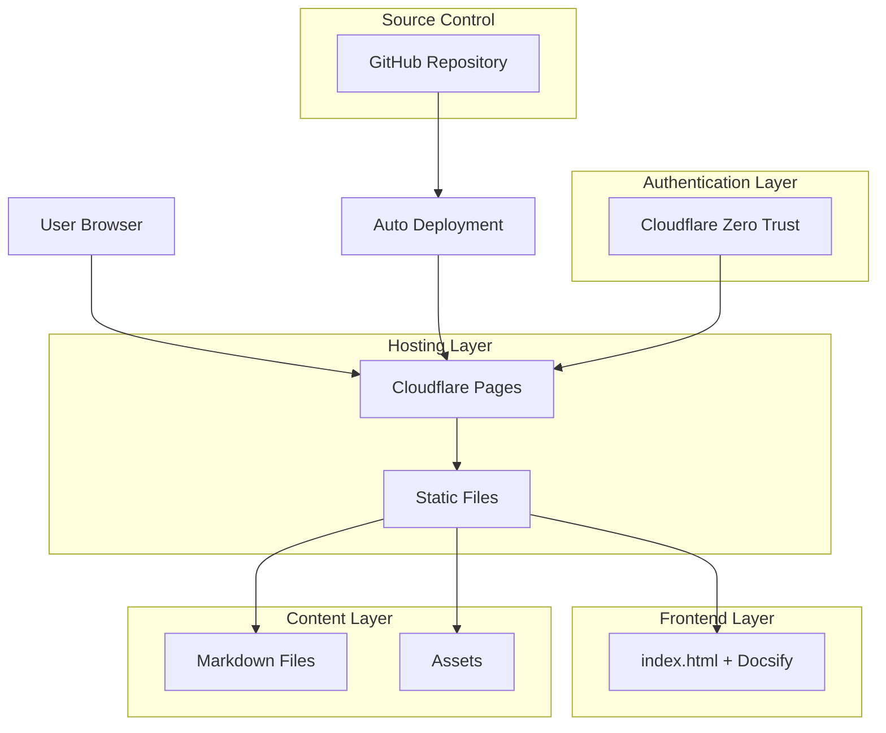
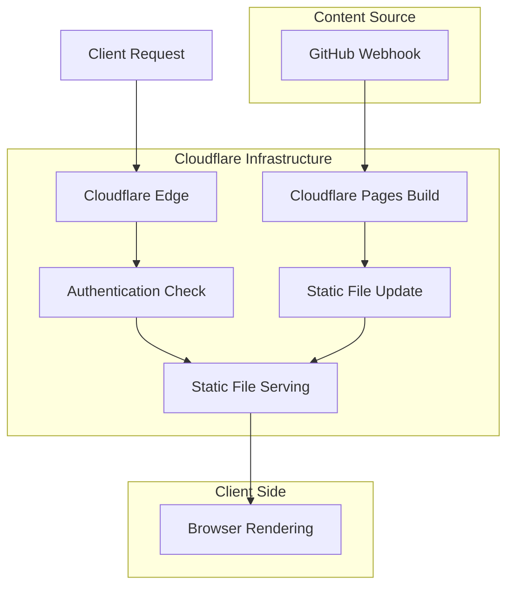
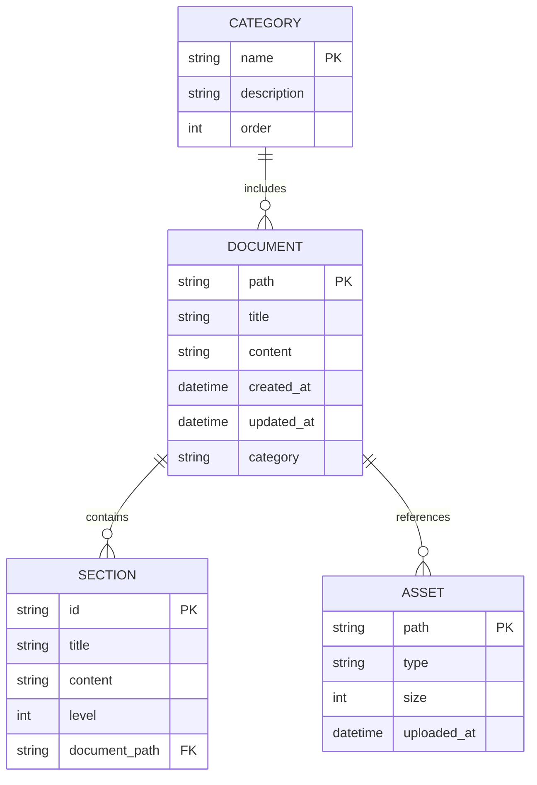

# docWiki 技术架构文档

## 1. Architecture Design



## 2. Technology Description

* Frontend: Docsify\@4 + docsify-mermaid\@2.0.1 + Pure HTML/CSS/JS

* Hosting: Cloudflare Pages (Static Hosting)

* Authentication: Cloudflare Zero Trust/Access

* Content Management: GitHub Repository + Markdown

* Search: Docsify built-in search plugin

* Diagram Rendering: Mermaid\@10 + docsify-mermaid plugin

## 3. Route Definitions

| Route               | Purpose        |
| ------------------- | -------------- |
| /                   | 首页，显示wiki主页和导航 |
| /#/docs/            | 文档根目录，显示文档列表   |
| /#/docs/README      | 文档首页，显示欢迎内容    |
| /#/docs/guide/      | 指南分类页面         |
| /#/docs/guide/style | 写作规范文档         |
| /#/docs/ops/        | 运维分类页面         |
| /#/docs/ops/backup  | 备份策略文档         |

## 4. API Definitions

### 4.1 Core API

由于采用纯静态方案，系统不包含传统的后端API。所有交互通过以下方式实现：

**文档获取**

```
GET /docs/{path}.md
```

* 直接获取Markdown文件内容

* 由Docsify在客户端动态加载和渲染

**搜索功能**

* 客户端搜索，无需API调用

* Docsify搜索插件在浏览器端建立索引

**认证授权**

* 通过Cloudflare Zero Trust处理

* 无需自定义API接口

## 5. Server Architecture Diagram



## 6. Data Model

### 6.1 Data Model Definition



### 6.2 Data Definition Language

由于采用文件系统存储，不使用传统数据库。数据结构通过目录和文件组织：

**目录结构**

```
/
├── index.html              # Docsify入口文件
├── docs/                   # 文档目录
│   ├── README.md          # 文档首页
│   ├── _sidebar.md        # 侧边栏配置
│   ├── guide/             # 指南分类
│   │   ├── README.md
│   │   └── style.md
│   └── ops/               # 运维分类
│       ├── README.md
│       └── backup.md
├── assets/                # 静态资源
│   ├── images/
│   └── files/
└── _redirects             # 重定向配置（可选）
```

**侧边栏配置示例 (\_sidebar.md)**

```markdown
- 入门
  - [主页](/docs/README.md)
  - [写作规范](/docs/guide/style.md)
- 运维
  - [备份策略](/docs/ops/backup.md)
```

**Docsify配置 (index.html)**

```html
<!doctype html>
<html>
<head>
  <meta charset="utf-8" />
  <title>docWiki</title>
  <meta name="viewport" content="width=device-width, initial-scale=1" />
  <link rel="stylesheet" href="https://cdn.jsdelivr.net/npm/docsify@4/themes/vue.css" />
</head>
<body>
  <div id="app">Loading...</div>
  <script>
    window.$docsify = {
      name: 'docWiki',
      repo: 'your-org/docwiki',
      loadSidebar: true,
      subMaxLevel: 2,
      auto2top: true,
      search: { 
        noData: '无结果', 
        paths: 'auto', 
        placeholder: '搜索…' 
      },
      mermaidConfig: {
        querySelector: ".mermaid"
      }
    };
  </script>
  <script src="https://cdn.jsdelivr.net/npm/docsify@4/lib/docsify.min.js"></script>
  <script src="https://cdn.jsdelivr.net/npm/docsify@4/lib/plugins/search.min.js"></script>
  <!-- Mermaid support -->
  <script type="module">
    import mermaid from "https://cdn.jsdelivr.net/npm/mermaid@10/dist/mermaid.esm.min.mjs";
    mermaid.initialize({ startOnLoad: true });
    window.mermaid = mermaid;
  </script>
  <script src="//unpkg.com/docsify-mermaid@2.0.1/dist/docsify-mermaid.js"></script>
</body>
</html>
```

