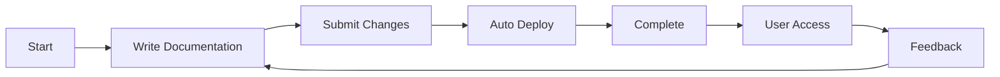
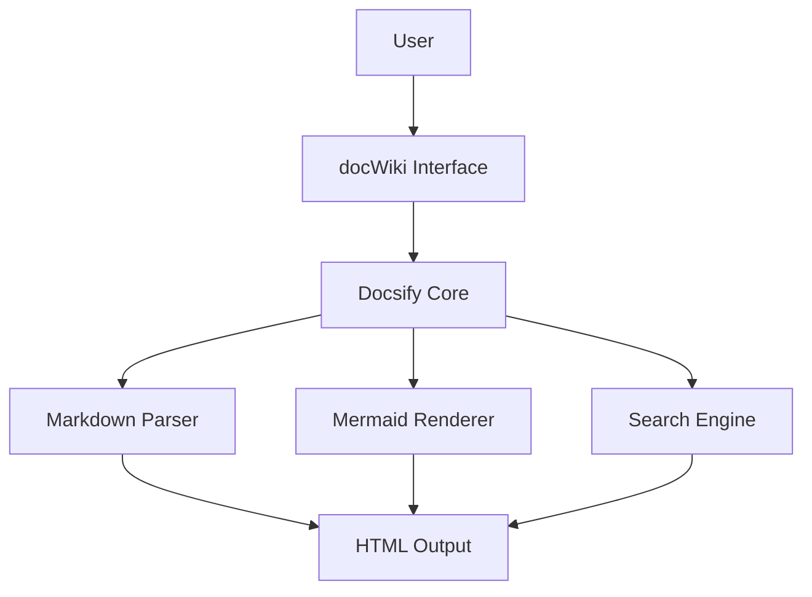

仅供测试使用，素材随机生成

# docWiki

Welcome to the docWiki Documentation System!

V1.2 improving UI

## Introduction

docWiki is a lightweight documentation system built on Docsify, supporting Markdown format and Mermaid diagram rendering.

## Features

- 📝 Markdown format document support
- 🎨 Clean and beautiful interface design
- 🔍 Full-text search functionality
- 📊 Mermaid diagram support
- 🚀 Quick deployment and access
- 🌐 Responsive design for all devices
- ⚡ Fast loading and navigation

## Quick Start

Please check the sidebar navigation on the left and select the document category you need.

## Getting Started Guide

1. **Browse Documentation**: Use the sidebar to navigate through different sections
2. **Search Content**: Use the search box to find specific topics
3. **View Diagrams**: Explore interactive Mermaid diagrams throughout the docs
4. **Mobile Friendly**: Access documentation on any device

## Mermaid Diagram Example

## Architecture Overview

---

*Last updated: 2024*
