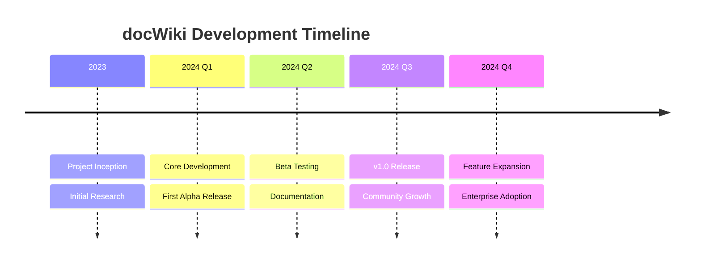
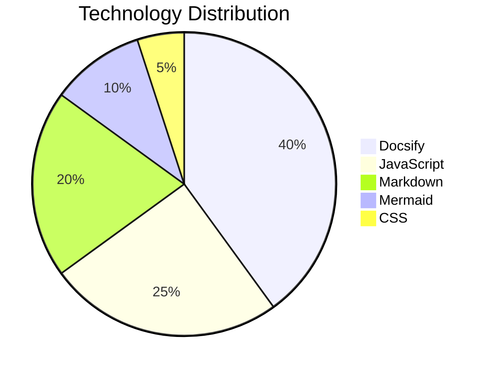
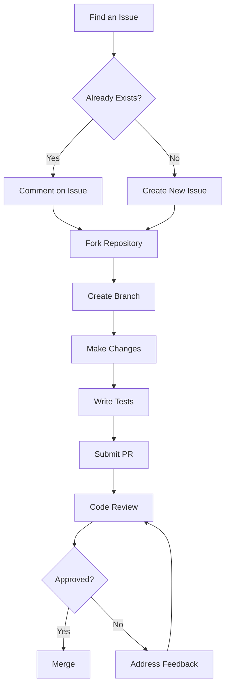
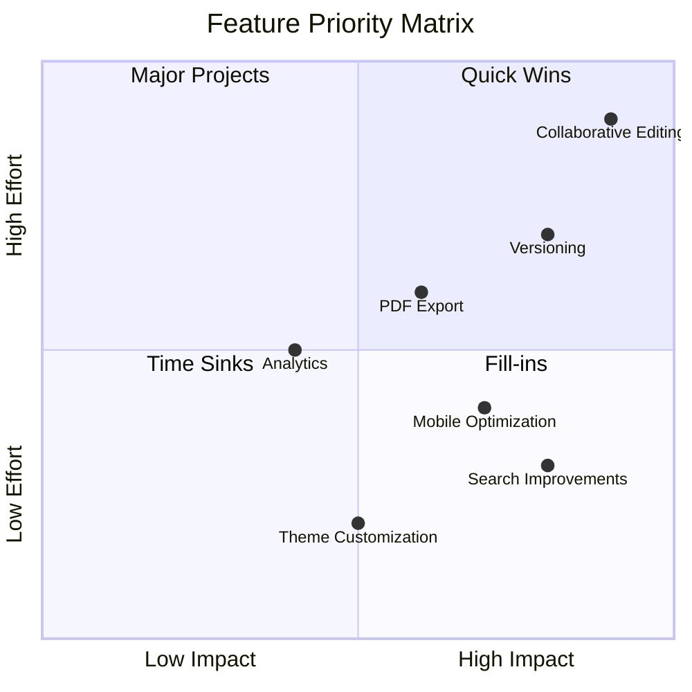

# About docWiki

Learn more about the docWiki project, its goals, and how to contribute.

## Project Overview

docWiki is a lightweight, modern documentation system built on Docsify. It's designed to make creating, maintaining, and sharing documentation as simple and efficient as possible.

### Core Values

- **Simplicity**: Easy to set up and use without complex build processes
- **Flexibility**: Adaptable to various documentation needs
- **Performance**: Fast loading and rendering even with large documentation sets
- **Accessibility**: Usable by everyone, regardless of technical expertise

## Project History

## Technology Stack

docWiki is built using the following technologies:

### Core Components

- **Docsify**: Zero-build documentation framework
- **Markdown**: Content authoring format
- **Mermaid**: Diagram rendering engine
- **Search Plugin**: Full-text search capability
- **Theme System**: Customizable appearance

## Team

The docWiki project is maintained by a dedicated team of documentation enthusiasts:

| Role | Responsibility |
|------|----------------|
| Project Lead | Overall direction and vision |
| Core Developers | Framework implementation |
| Documentation Writers | Content creation and maintenance |
| Community Managers | User support and community engagement |

## Contributing

We welcome contributions from the community! Here's how you can help:

### Contribution Process

### Code of Conduct

We expect all contributors to adhere to our Code of Conduct:

1. **Be Respectful**: Treat everyone with respect and kindness
2. **Be Inclusive**: Welcome contributors of all backgrounds and skill levels
3. **Be Collaborative**: Work together to improve the project
4. **Be Constructive**: Provide helpful feedback and suggestions

## Roadmap

Our future plans for docWiki include:

### Short-term Goals

- Enhance mobile responsiveness
- Improve search functionality
- Add more diagram types
- Expand plugin ecosystem

### Long-term Vision

- Collaborative editing features
- Advanced versioning system
- Integration with popular development tools
- Enterprise-grade security features

## License

docWiki is released under the MIT License, which means:

- You can freely use, modify, and distribute it
- You must include the original copyright notice
- The software is provided "as is" without warranty

## Contact

Have questions or suggestions? Reach out to us:

- **GitHub**: [github.com/docwiki](https://github.com/docwiki)
- **Twitter**: [@docwiki](https://twitter.com/docwiki)
- **Email**: support@docwiki.org

---

*Thank you for your interest in the docWiki project!*