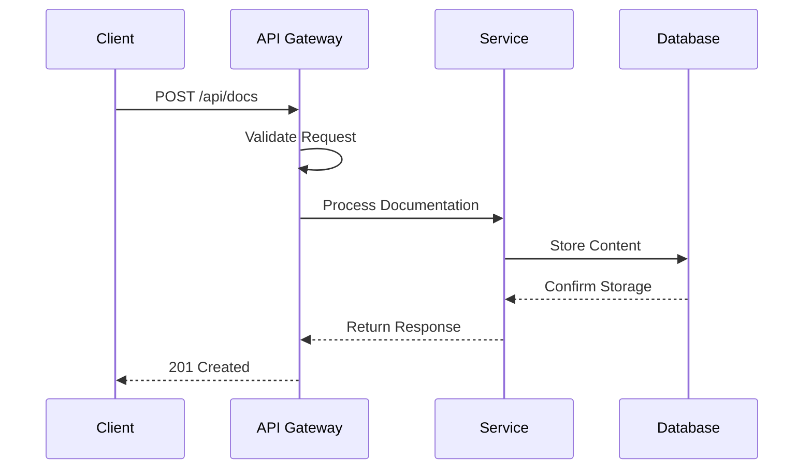
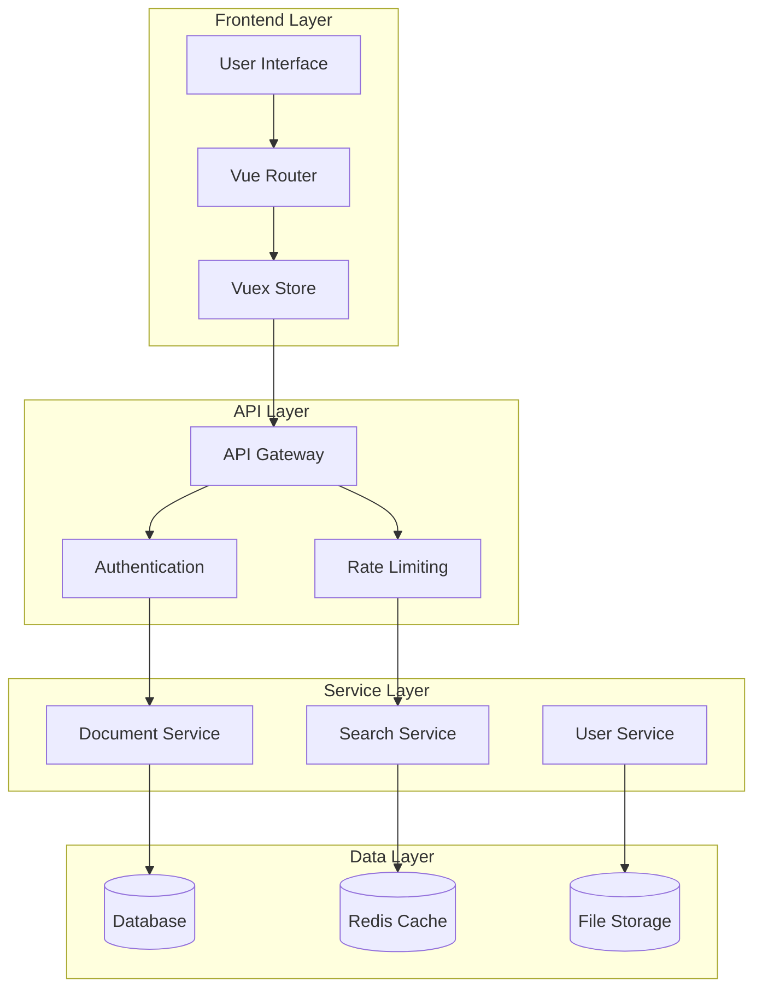

仅供测试使用，素材随机生成

# API Reference

This document provides comprehensive API reference for docWiki integration and customization.

## Overview

docWiki provides several APIs for extending functionality and integrating with external systems.

## Core APIs

### Configuration API

Configure docWiki settings programmatically:

```javascript
// Basic configuration
window.$docsify = {
  name: 'docWiki',
  repo: 'https://github.com/your-repo/docwiki',
  loadSidebar: true,
  subMaxLevel: 2,
  search: {
    maxAge: 86400000,
    paths: 'auto',
    placeholder: 'Search documentation...',
    noData: 'No results found.'
  }
};
```

### Plugin API

Create custom plugins:

```javascript
// Custom plugin example
function customPlugin(hook, vm) {
  hook.beforeEach(function (html) {
    // Process content before rendering
    return html + '\n\n---\n*Generated by docWiki*';
  });
  
  hook.doneEach(function () {
    // Execute after each page render
    console.log('Page rendered successfully');
  });
}

// Register plugin
window.$docsify.plugins = [customPlugin];
```

## Mermaid Integration

### API Flow Diagram



### System Architecture



## REST Endpoints

### Documents

| Method | Endpoint | Description |
|--------|----------|-------------|
| GET | `/api/docs` | List all documents |
| GET | `/api/docs/{id}` | Get specific document |
| POST | `/api/docs` | Create new document |
| PUT | `/api/docs/{id}` | Update document |
| DELETE | `/api/docs/{id}` | Delete document |

### Search

| Method | Endpoint | Description |
|--------|----------|-------------|
| GET | `/api/search?q={query}` | Search documents |
| GET | `/api/search/suggestions` | Get search suggestions |

## Response Formats

### Success Response

```json
{
  "status": "success",
  "data": {
    "id": "doc-123",
    "title": "API Documentation",
    "content": "# API Reference\n\nThis is the content...",
    "created_at": "2024-01-01T00:00:00Z",
    "updated_at": "2024-01-01T12:00:00Z"
  },
  "meta": {
    "version": "1.0",
    "timestamp": "2024-01-01T12:00:00Z"
  }
}
```

### Error Response

```json
{
  "status": "error",
  "error": {
    "code": "VALIDATION_ERROR",
    "message": "Invalid document format",
    "details": [
      {
        "field": "title",
        "message": "Title is required"
      }
    ]
  }
}
```

---

*API Reference for docWiki v1.0*