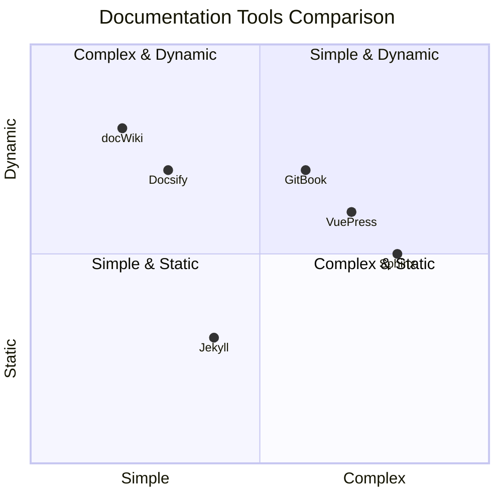
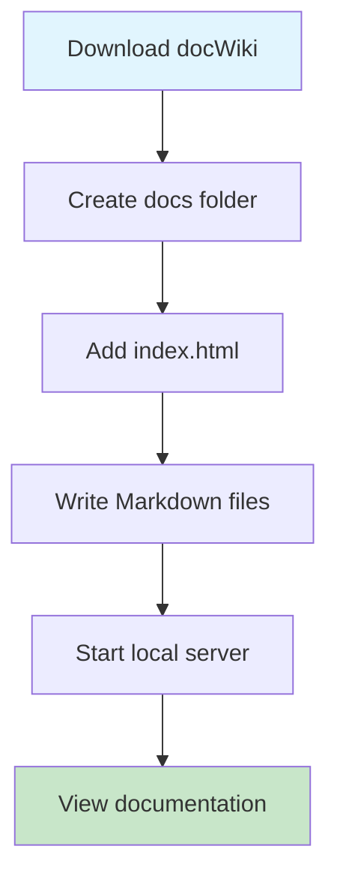
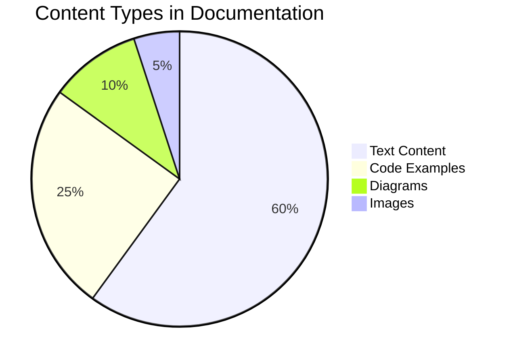
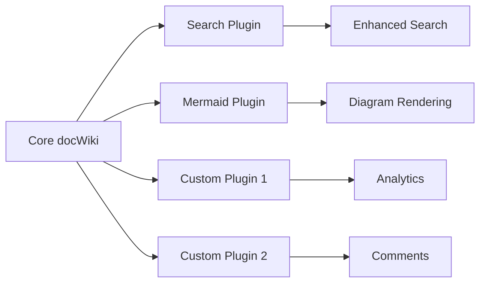
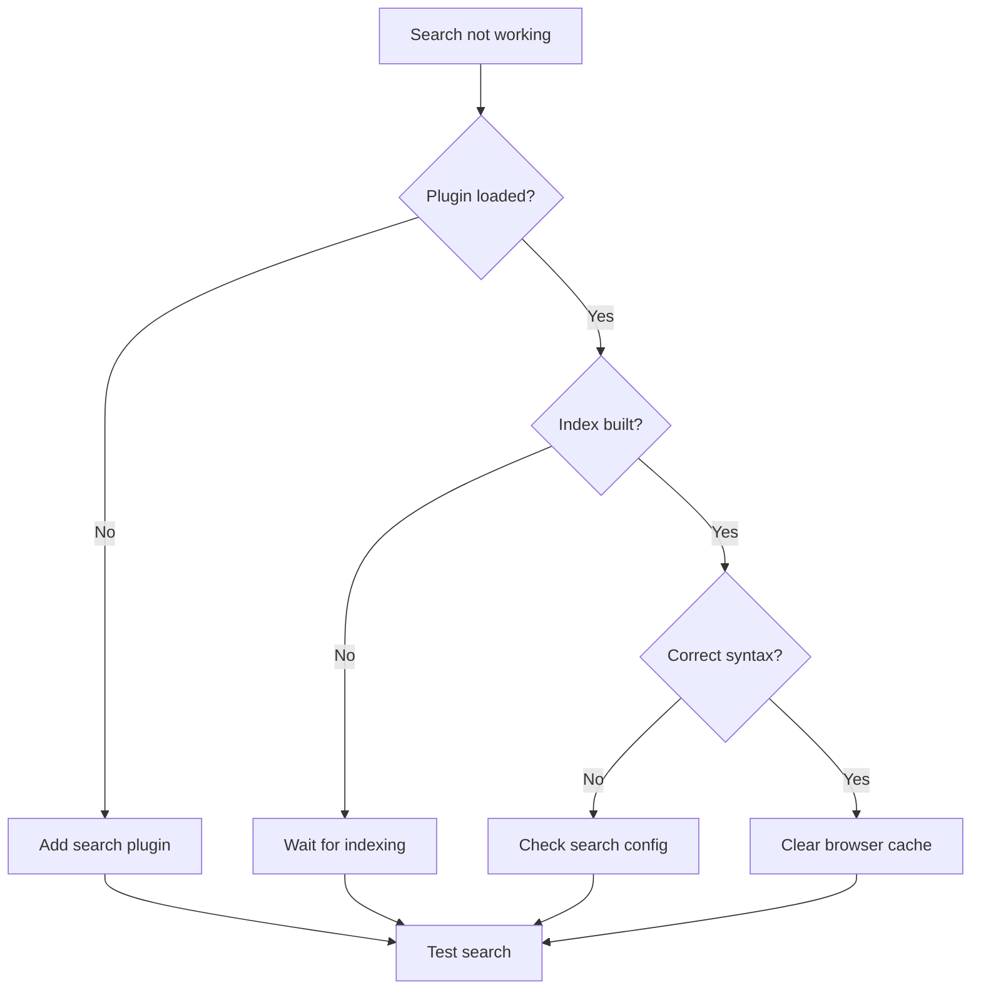
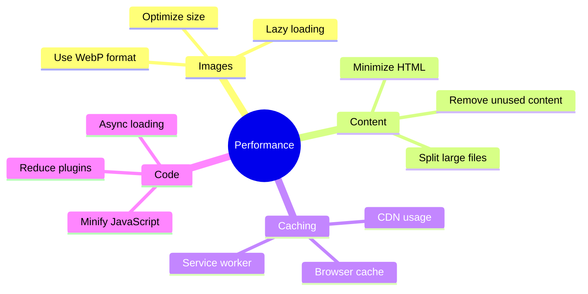
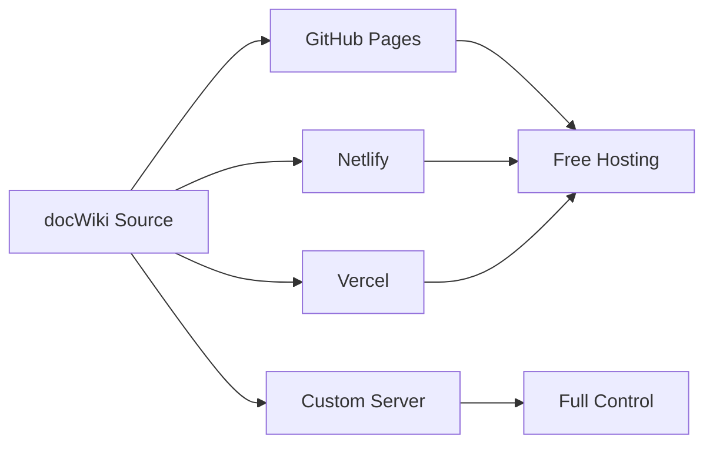

# Frequently Asked Questions

Find answers to common questions about docWiki usage, troubleshooting, and best practices.

## General Questions

### What is docWiki?

docWiki is a lightweight documentation system built on Docsify that supports Markdown content and Mermaid diagrams. It's designed for creating beautiful, searchable documentation without complex build processes.

### How is docWiki different from other documentation tools?



### Do I need to know programming to use docWiki?

No! docWiki is designed for non-technical users. You only need to know basic Markdown syntax to create beautiful documentation.

## Setup and Installation

### How do I set up docWiki?

The setup process is straightforward:



### What are the system requirements?

- Modern web browser (Chrome, Firefox, Safari, Edge)
- Local web server (Python, Node.js, or any HTTP server)
- Text editor for writing Markdown

### Can I use docWiki offline?

Yes! docWiki works completely offline once you have the files locally. No internet connection required for viewing documentation.

## Content Creation

### How do I add new pages?

1. Create a new `.md` file in the `docs` directory
2. Write your content using Markdown syntax
3. Update `_sidebar.md` to include the new page
4. Refresh your browser to see the changes

### What Markdown features are supported?

docWiki supports all standard Markdown features plus:

- Tables
- Code syntax highlighting
- Mermaid diagrams
- Custom CSS classes
- HTML elements

### How do I create diagrams?

Use Mermaid syntax within code blocks:



## Customization

### Can I customize the appearance?

Yes! You can customize:

- Colors and themes
- Fonts and typography
- Layout and spacing
- Custom CSS styles

### How do I add a custom logo?

Add your logo to the Docsify configuration:

```javascript
window.$docsify = {
  name: 'Your Project',
  logo: '/assets/logo.png',
  // other settings...
};
```

### Can I add custom plugins?

Absolutely! docWiki supports all Docsify plugins and you can create custom ones:



## Troubleshooting

### Why aren't my diagrams rendering?

Common causes and solutions:

| Issue | Cause | Solution |
|-------|-------|----------|
| Blank diagram area | Syntax error | Check Mermaid syntax |
| No diagram at all | Missing plugin | Verify Mermaid plugin is loaded |
| Partial rendering | Browser compatibility | Update browser or try different one |
| Slow rendering | Complex diagram | Simplify diagram or split into parts |

### My search isn't working. What should I do?



### How do I fix broken links?

1. Check file paths are correct
2. Ensure files exist in specified locations
3. Use relative paths from the docs directory
4. Test links in browser

### The site loads slowly. How can I improve performance?

Performance optimization tips:



## Advanced Usage

### Can I integrate with version control?

Yes! docWiki works great with Git:

- Track changes to documentation
- Collaborate with team members
- Deploy automatically on commits
- Maintain version history

### How do I deploy docWiki?

Deployment options:



### Can I use docWiki for team documentation?

Absolutely! docWiki is perfect for:

- API documentation
- User manuals
- Internal wikis
- Project documentation
- Knowledge bases

## Support

### Where can I get help?

- Check this FAQ first
- Browse the documentation
- Search GitHub issues
- Join our community discussions
- Contact support team

### How do I report bugs?

1. Check if the issue already exists
2. Create a minimal reproduction case
3. Include system information
4. Submit detailed bug report
5. Follow up on responses

---

*Still have questions? Feel free to reach out to our community!*