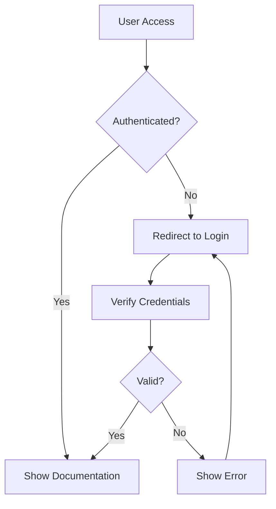
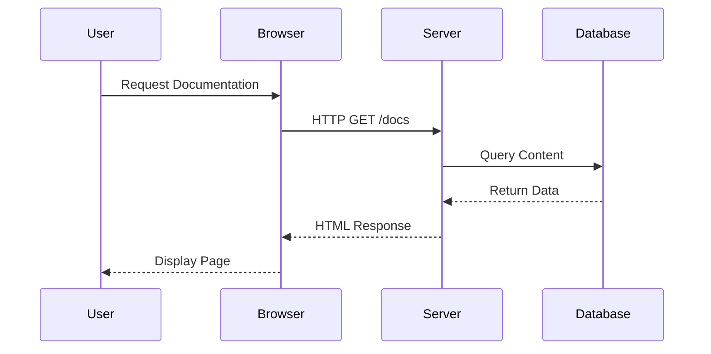

# User Guide

This is the docWiki user guide page, designed to help you get the most out of the documentation system.

## Writing Documentation

### Markdown Syntax

docWiki supports standard Markdown syntax, including:

- **Bold text**
- *Italic text*
- `Inline code`
- [Links](https://example.com)
- > Blockquotes
- Lists (ordered and unordered)
- Tables
- Images

### Code Blocks

You can include syntax-highlighted code blocks:

```javascript
// JavaScript code example
function greetUser(name) {
    console.log(`Hello, ${name}! Welcome to docWiki!`);
    return `Welcome message sent to ${name}`;
}

// Usage
greetUser('Developer');
```

```python
# Python code example
def calculate_fibonacci(n):
    """Calculate the nth Fibonacci number"""
    if n <= 1:
        return n
    return calculate_fibonacci(n-1) + calculate_fibonacci(n-2)

# Generate first 10 Fibonacci numbers
fib_sequence = [calculate_fibonacci(i) for i in range(10)]
print(fib_sequence)
```

### Mermaid Diagrams

You can create various types of diagrams using Mermaid syntax:

#### Flowchart Example



#### Sequence Diagram



## Best Practices

### File Organization

- Use `.md` extension for all documentation files
- Place images in `assets/images/` directory
- Maintain clear directory structure for easy navigation
- Use descriptive filenames

### Content Guidelines

1. **Keep it Simple**: Write clear, concise content
2. **Use Headers**: Structure content with proper heading hierarchy
3. **Add Examples**: Include practical examples and code snippets
4. **Link Related Content**: Cross-reference related documentation
5. **Update Regularly**: Keep content current and accurate

### Mermaid Tips

- Test diagrams before publishing
- Keep diagrams simple and readable
- Use consistent styling across diagrams
- Add descriptive labels to diagram elements

## Troubleshooting

### Common Issues

| Issue | Solution |
|-------|----------|
| Mermaid not rendering | Check syntax and ensure proper code block formatting |
| Images not loading | Verify file paths and ensure images exist |
| Search not working | Ensure content is properly indexed |
| Mobile display issues | Test responsive design on various devices |

---

*This guide helps you create effective documentation using docWiki's features.*