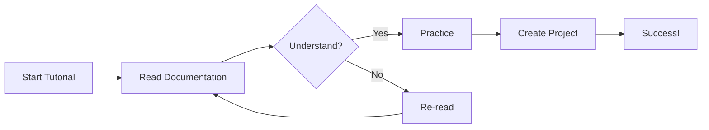
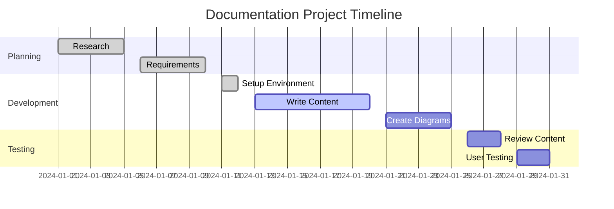
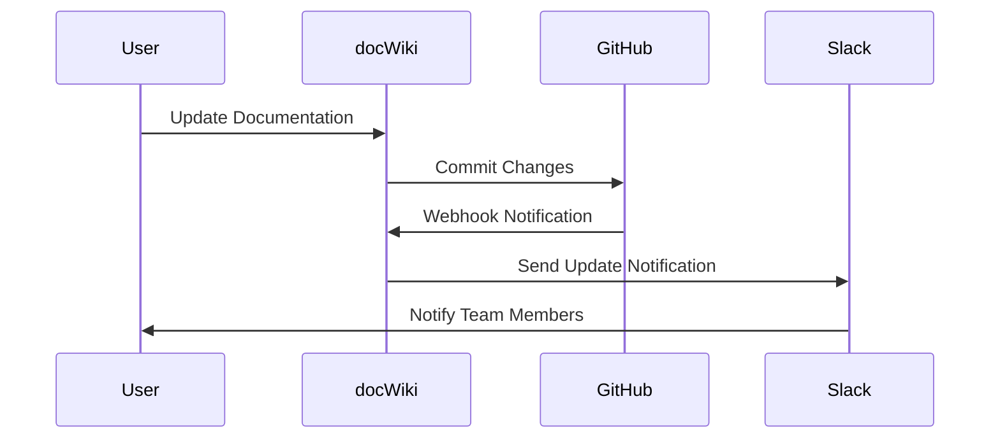

# Tutorials

Step-by-step tutorials to help you master docWiki and create amazing documentation.

## Getting Started Tutorial

### Step 1: Setup Your Environment

Before you begin, ensure you have the following:

- A modern web browser
- Basic knowledge of Markdown
- Text editor (VS Code recommended)

### Step 2: Create Your First Document

1. Create a new `.md` file in the `docs` directory
2. Add a title using `# Your Title`
3. Write your content using Markdown syntax
4. Save the file

```markdown
# My First Document

Welcome to my documentation!

## Introduction

This is a sample document to demonstrate docWiki features.

### Features

- Easy to write
- Beautiful rendering
- Interactive diagrams
```

### Step 3: Add Navigation

Update the `_sidebar.md` file to include your new document:

```markdown
- Getting Started
  - [Home](/docs/README.md)
  - [My First Doc](/docs/my-first-doc.md)
```

## Advanced Tutorials

### Creating Interactive Diagrams

Learn how to create various types of Mermaid diagrams:

#### 1. Flowcharts



#### 2. Gantt Charts



#### 3. Class Diagrams

```mermaid
classDiagram
    class Document {
        +String title
        +String content
        +Date createdAt
        +Date updatedAt
        +render()
        +save()
        +delete()
    }
    
    class Section {
        +String heading
        +String content
        +Number level
        +addContent()
        +updateHeading()
    }
    
    class Diagram {
        +String type
        +String definition
        +render()
        +validate()
    }
    
    Document ||--o{ Section : contains
    Section ||--o{ Diagram : includes
```

### Customizing Themes

Learn how to customize the appearance of your documentation:

#### CSS Customization

```css
/* Custom theme variables */
:root {
  --theme-color: #0074D9;
  --text-color-base: #333;
  --text-color-secondary: #666;
}

/* Custom styles */
.sidebar {
  background: linear-gradient(135deg, #667eea 0%, #764ba2 100%);
}

.markdown-section h1 {
  color: var(--theme-color);
  border-bottom: 2px solid var(--theme-color);
}
```

### Integration Tutorial

Integrate docWiki with external services:



## Best Practices

### Content Organization

1. **Hierarchical Structure**: Organize content in logical hierarchies
2. **Consistent Naming**: Use consistent file and folder naming conventions
3. **Cross-References**: Link related content together
4. **Regular Updates**: Keep content current and accurate

### Performance Tips

- Optimize images before adding them
- Keep individual files under 100KB when possible
- Use lazy loading for large content
- Minimize external dependencies

### Collaboration Workflow

```mermaid
gitgraph
    commit id: "Initial docs"
    branch feature-branch
    checkout feature-branch
    commit id: "Add new tutorial"
    commit id: "Update examples"
    checkout main
    commit id: "Fix typos"
    merge feature-branch
    commit id: "Release v1.1"
```

## Troubleshooting

### Common Issues

| Problem | Solution |
|---------|----------|
| Diagrams not rendering | Check Mermaid syntax |
| Broken links | Verify file paths |
| Slow loading | Optimize images and content |
| Mobile issues | Test responsive design |

---

*Complete these tutorials to become a docWiki expert!*